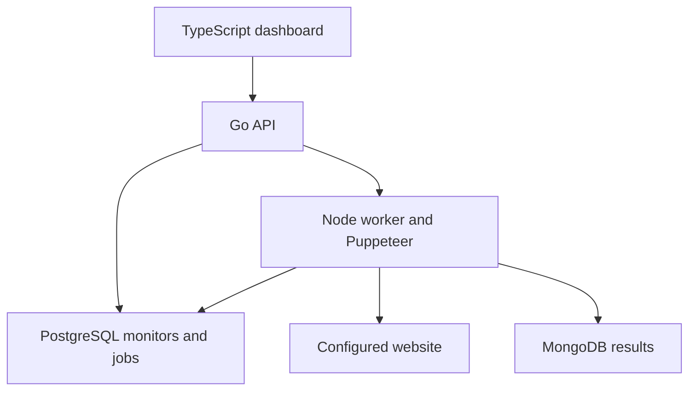

# SitePulse

A local-first website monitoring portfolio project: a Go API, TypeScript dashboard,
PostgreSQL durable job queue, MongoDB result documents, and Puppeteer browser checks.

## Run it

Prerequisites: Docker Desktop with Compose, Node.js 22+, and an internet connection
for the first image build. On Windows, run these commands in PowerShell inside this folder.

```sh
node scripts/setup.mjs
docker compose up --build -d
```

Open http://localhost:8080. Open `.env`, copy the `API_TOKEN` value, paste it into the
dashboard, and select **Connect → Run check → View result**. The token stays in page
memory. The seeded monitor checks the bundled demo website, so no outside site is needed.

```sh
node scripts/smoke.mjs
# Stop without deleting saved records:
docker compose down
```

## What is implemented

- Go HTTP API with bearer authentication, parameterized SQL, request limits, and timeouts.
- Strict TypeScript dashboard with queue states, manual checks, polling, and screenshot viewer.
- SQL relationship between monitors and runs; worker leasing with `FOR UPDATE SKIP LOCKED`.
- Independent Node.js worker running Puppeteer for real page visits and screenshots.
- MongoDB stores page title, heading, HTTP status, duration, browser errors and screenshot.
- Retry up to three attempts after browser failures, with lease recovery after worker crashes.
- Deterministic smoke test and GitHub Actions integration workflow.

Checks are **manual**, not scheduled. A completed run means the browser inspection
finished; it does not mean the target returned HTTP 200. Inspect the status and errors.



## API

All `/api/` endpoints require `Authorization: Bearer <API_TOKEN>`.

| Method | Route | Purpose |
| --- | --- | --- |
| GET | /healthz | API and PostgreSQL readiness |
| GET | /api/monitors | Configured monitors |
| POST | /api/runs | Queue `{ "monitor_id": 1 }`; returns HTTP 202 |
| GET | /api/runs | Latest 50 runs |
| GET | /api/results/{id} | Result document; 404 until available |

## Add your own website

Use only a site you own or have permission to inspect. Add its exact origin (no
trailing slash) to `ALLOWED_ORIGINS` in `.env`, for example
`http://fixture,https://your-site.example`. Insert a monitor with SQL:

```sh
docker compose exec postgres psql -U sitepulse
```

```sql
INSERT INTO monitors(name,url) VALUES ('My website','https://your-site.example/');
\q
```

Then run `docker compose up -d --force-recreate worker` and reconnect the dashboard.
Cross-origin requests, including redirects and third-party assets, are blocked unless
the operator explicitly adds their origins. This may change how real sites render.
Only add trusted origins; this is not an arbitrary public URL scanner or a hardened
sandbox against hostile sites and DNS rebinding. Chromium runs without its sandbox
inside the container, so keep the service local.

## Architecture and data flow

1. The API inserts a `runs` row in PostgreSQL with state `queued`.
2. The worker transaction claims one row using `FOR UPDATE SKIP LOCKED`, changes it to
   `running`, assigns a random lease token, and increments the attempt count.
3. Puppeteer checks the monitor URL under the origin allowlist and records a screenshot
   and structured metadata in MongoDB using the run ID as `_id`.
4. The SQL row moves to `completed`. A failure returns it to `queued` until attempt 3,
   then it becomes `failed`.
5. If a worker dies, expired `running` leases are re-queued by later claim transactions.
6. The API joins SQL run metadata with MongoDB result documents for the dashboard.

The SQL queue is the source of truth for work state. MongoDB stores only completed
result documents. Delivery is **at least once**, not exactly once. Attempt versions reject stale-worker result overwrites; a lease token also fences SQL
updates from workers that no longer own a job.

## Validation

See [`docs/VALIDATION.md`](docs/VALIDATION.md) for the repeatable validation procedure
and [`docs/LEARNING.md`](docs/LEARNING.md) for the implementation notes and trade-offs.
